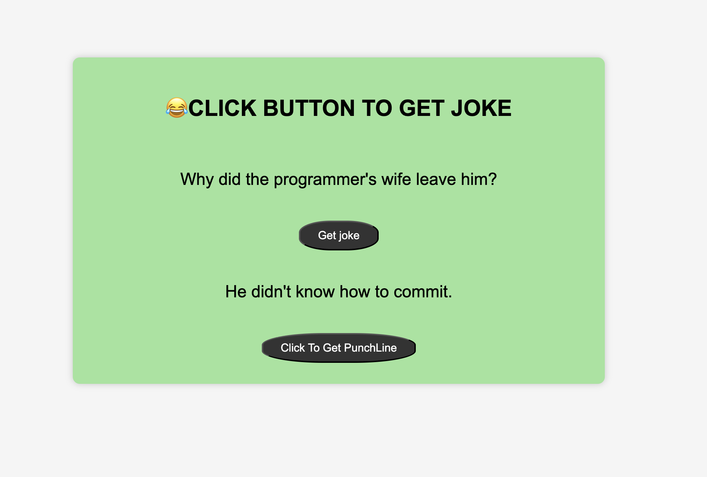

# 😂 Random Joke Generator

A fun and interactive web app that displays random jokes fetched from the **Official Joke API**.  
You can view the joke setup first, then click again to reveal the punchline!

---

## 🖥️ Live Demo

🔗 **[View Deployed App on GitHub Pages](https://<your-github-username>.github.io/<your-repo-name>/)**

*(After deployment, replace `<your-github-username>` and `<your-repo-name>` with your actual details.)*

---

## 📂 Project Structure

📁 Random-Joke-Generator
├── index.html
├── script.js
├── README.md
└── style (inline in HTML)

yaml
Copy code

---

## 🚀 Features

✅ Fetches a **random joke** from the [Official Joke API](https://official-joke-api.appspot.com/random_joke)  
✅ Displays the **setup** first  
✅ Reveals the **punchline** when the second button is clicked  
✅ Responsive and simple UI  
✅ Built using **HTML**, **CSS**, and **Vanilla JavaScript**

---

## 🧠 How It Works

1. When the user clicks **“Get Joke”**, the app fetches data from:
https://official-joke-api.appspot.com/random_joke

yaml
Copy code
2. It displays the **setup** of the joke.
3. When the user clicks **“Click To Get PunchLine”**, the **punchline** is revealed.
4. Clicking “Get Joke” again resets the punchline section.

---

## ⚙️ Setup Instructions (Run Locally)

1. **Clone the Repository**
```bash
git clone https://github.com/Ganesh327/Random-Joke-Generator.git
Navigate into the project folder

bash
Copy code
cd <your-repo-name>
Open the HTML file

Just open index.html in your browser.
(No server setup required — it’s a static site!)

🌐 Deployment Guide (GitHub Pages)
Push your code to GitHub (steps below):

bash
Copy code
git init
git add .
git commit -m "Initial commit - Random Joke Generator"
git branch -M main
git remote add origin https://github.com/Ganesh327/Random-Joke-Generator
git push -u origin main
Go to your repository on GitHub
👉 Click Settings → Pages

Under Build and Deployment, choose:

Source: Deploy from a branch

Branch: main

Folder: / (root)

Click Save, and wait a minute.

Your app will be live at:

php-template
https://github.com/Ganesh327/Random-Joke-Generator
🖼️ Preview (Optional)
You can add a screenshot for a better presentation:

markdown

📜 API Used
Official Joke API:
https://official-joke-api.appspot.com/random_joke

Returns JSON in this format:

json
Copy code
{
  "id": 274,
  "type": "general",
  "setup": "Why do we never tell secrets on a farm?",
  "punchline": "Because the potatoes have eyes and the corn has ears."
}
🧑‍💻 Technologies Used
HTML5

CSS3

JavaScript (ES6)

Fetch API

💡 Future Enhancements
Add a “Copy Joke” button.

Include categories like Programming / Dad jokes.

Add animation transitions between jokes.

👨‍🎨 Author
Developed by: [ Maddiboina Venkata Ganesh] 
💼 GitHub: https://github.com/<your-github-username>